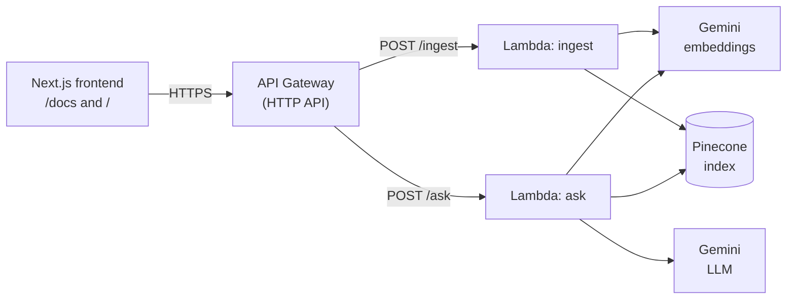

# Doc Q&A

Upload plain-text documents and ask questions about them. The answers come from an LLM that only sees the
parts of your documents that are relevant to the question (RAG: retrieval-augmented generation).

- **Frontend:** Next.js 16 + TypeScript (`/docs` to upload documents, `/` to ask questions)
- **Backend:** AWS API Gateway (HTTP API) → two Lambda functions in Node.js 22 + TypeScript
- **Vector store:** Pinecone
- **Embeddings and LLM:** Google Gemini
- **Infrastructure as code:** AWS SAM (`backend/template.yaml`)
- **No RAG framework:** no LangChain, no LlamaIndex. The whole flow
  (chunk → embed → store → query → build prompt → call LLM → answer) is implemented in `backend/src`.

## Live deployment

> Remove this section if the stack is deleted before the review.

```
https://t8fr2qwgv5.execute-api.us-east-1.amazonaws.com
```

The API has no authentication (as requested) and it is rate limited. Everything uploaded to it goes into one
shared Pinecone index, so please do not upload sensitive data.

## Architecture



### How it works

**Ingesting a document (`POST /ingest`)**

1. The request is validated (see [Limits](#limits)).
2. Each document is split into chunks (see [Chunking](#chunking)).
3. All the chunks of a document are embedded in one call (batches of 50) with `gemini-embedding-001`
   (768 dimensions, task type `RETRIEVAL_DOCUMENT`).
4. The chunks already stored for that document are deleted, and the new ones are upserted. The record id is
   `<docId>#chunk-<n>` and the metadata is `docId`, `title` and `chunkText`.

Embedding happens **before** deleting, so if the embedding API fails the previous version of the document is
still there. Re-ingesting an id replaces the document: no duplicates, and no orphan chunks when the new version
is shorter.

**Asking a question (`POST /ask`)**

1. The question is embedded (task type `RETRIEVAL_QUERY`) and the `topK` closest chunks are fetched from Pinecone.
2. Chunks with a similarity score below `MIN_SCORE` (default `0.65`) are discarded.
3. If nothing is left, the API answers "I don't have enough information…" **without calling the LLM**.
4. Otherwise a prompt is built from the question and the chunks, and sent to the LLM.
5. The response is the answer plus the sources, one per document (a document with several matching chunks is
   listed once).

The prompt tells the model to answer **only** from the context, to answer in complete sentences, to say so when
the context has no answer, and to treat the context as reference material and not as instructions (a basic
defence against prompt injection from uploaded documents).

### Chunking

`backend/src/core/chunking.ts`, about 800 characters per chunk with 100 characters of overlap:

- The text is split into paragraphs (blank lines), and consecutive paragraphs are grouped until a chunk is full.
  Paragraphs are never split if they fit.
- A Markdown heading (`## Title`) is glued to the paragraph that follows it, so a heading never ends one chunk
  while its content starts the next.
- A paragraph longer than the limit is cut at the last whitespace, not in the middle of a word. A single token
  without whitespace (such as a very long URL) is cut at the limit.
- Each chunk starts with the end of the previous one (the overlap), starting at a word boundary, so a sentence
  that falls on the border is complete in at least one chunk.

**Trade-off:** small chunks give precise matches but may lose context; big chunks keep context but dilute the
embedding and add noise to the prompt. 800 characters is roughly a paragraph or two.

## Repository layout

```
backend/
  src/
    core/         pure logic, no AWS or vendor SDKs: chunking, prompt, ingest and ask services
    providers/    interfaces (types.ts) and their Gemini and Pinecone implementations
    http/         request validation (zod), body parsing and response builders (CORS, error codes)
    handlers/     Lambda handlers (factories that receive the service) and the service wiring
    config.ts     reads and validates the environment variables
  tests/          unit tests (vitest)
  scripts/        local dev server and manual checks against the real services
  template.yaml   SAM template: HTTP API, two Lambdas, parameters, outputs
frontend/
  app/            pages: / (ask) and /docs (upload)
  lib/api.ts      typed client for the backend
  components/     navigation
```

`core/` only depends on the interfaces in `providers/types.ts` (`EmbeddingProvider`, `LLMProvider`,
`VectorStore`). That is what makes the services testable with fakes and the vendors replaceable.

## Prerequisites

- Node.js 22 or newer
- A [Google AI Studio](https://aistudio.google.com/) API key (the free tier is enough)
- A [Pinecone](https://www.pinecone.io/) account (the free Starter plan is enough) with an index created by hand:
  - Name: `doc-qa` (or anything, set it in `PINECONE_INDEX`)
  - Type: serverless
  - Metric: `cosine`
  - Dimensions: `768` (it must match `EMBEDDING_DIMENSION`; if you change the embedding model or dimension you
    need a new index)
- To deploy: an AWS account, the AWS CLI configured (`aws configure`) and the
  [SAM CLI](https://docs.aws.amazon.com/serverless-application-model/latest/developerguide/install-sam-cli.html)

## Run it locally

### 1. Backend

```powershell
cd backend
npm install
copy .env.example .env      # then fill in GEMINI_API_KEY, PINECONE_API_KEY and PINECONE_INDEX
npm run dev                 # http://localhost:3001  (POST /ingest, POST /ask)
```

`npm run dev` starts a small HTTP server that turns each request into an API Gateway event and calls the same
Lambda handlers that get deployed, so there is no need for AWS or Docker.

### 2. Frontend

```powershell
cd frontend
npm install
copy .env.example .env.local     # NEXT_PUBLIC_API_URL=http://localhost:3001
npm run dev                      # http://localhost:3000
```

Open `http://localhost:3000/docs`, add a document, wait a few seconds (Pinecone is eventually consistent, new
documents can take a few seconds to show up in searches) and ask a question on `http://localhost:3000`.

`NEXT_PUBLIC_API_URL` is read when Next.js starts, so restart `npm run dev` after changing it. Do not add a
trailing slash.

### 3. Tests

```powershell
cd backend
npm test            # 167 unit tests, no network and no API keys needed
npm run typecheck
npm run format:check
```

## Configuration

Environment variables of the backend (`backend/.env` locally, SAM parameters when deployed):

| Variable              | Required | Default                | Description                                               |
| --------------------- | -------- | ---------------------- | --------------------------------------------------------- |
| `GEMINI_API_KEY`      | yes      |                        | Google AI Studio key, used for embeddings and for the LLM |
| `PINECONE_API_KEY`    | yes      |                        | Pinecone key                                              |
| `PINECONE_INDEX`      | yes      |                        | Name of the Pinecone index                                |
| `EMBEDDING_MODEL`     | no       | `gemini-embedding-001` | Embedding model                                           |
| `EMBEDDING_DIMENSION` | no       | `768`                  | Embedding size, must match the index                      |
| `LLM_MODEL`           | no       | `gemini-3.8-flash`     | Model that writes the answer                              |
| `MIN_SCORE`           | no       | `0.65`                 | Minimum similarity (0 to 1) for a chunk to be used        |

Frontend: `NEXT_PUBLIC_API_URL` (base URL of the backend).

## API

Base URL: `http://localhost:3001` locally, or the `ApiUrl` output of the deployed stack. Bodies are JSON.

### `POST /ingest`

```json
{
  "documents": [
    {
      "id": "refund-policy",
      "title": "Refund Policy",
      "content": "Full refund within 30 days with receipt. No refunds on digital goods."
    }
  ]
}
```

Response `200`:

```json
{ "ingestedDocuments": 1, "ingestedChunks": 1 }
```

### `POST /ask`

```json
{ "question": "Can I get a refund on a digital product?", "topK": 3 }
```

`topK` is optional (default 3, from 1 to 10). Response `200`:

```json
{
  "answer": "No, you cannot get a refund on a digital product. According to the policy, there are no refunds on digital goods.",
  "sources": [{ "docId": "refund-policy", "title": "Refund Policy" }]
}
```

When no document is relevant the answer is `"I don't have enough information to answer that question."` and
`sources` is `[]` (still `200`).

### Errors

| Status | When                                                            | Body                                                                                  |
| ------ | --------------------------------------------------------------- | ------------------------------------------------------------------------------------- |
| `400`  | Missing body, invalid JSON, or the request breaks a rule        | `{ "error": "Invalid request", "details": ["documents.0.id: id may only contain…"] }` |
| `429`  | API Gateway throttling (more than 5 requests per second)        | `{ "message": "Too Many Requests" }`                                                  |
| `502`  | Gemini or Pinecone failed (down, over quota…)                   | `{ "error": "bad gateway" }`                                                          |
| `500`  | Anything unexpected, for example a missing environment variable | `{ "error": "internal error" }`                                                       |

The `502` and `500` bodies are deliberately generic: the real error is written to the logs (CloudWatch) and never
sent to the client.

### Examples

PowerShell (no quoting problems):

```powershell
$api = "http://localhost:3001"      # or the deployed URL, without a trailing slash

$body = @{
  documents = @(@{
    id      = "refund-policy"
    title   = "Refund Policy"
    content = "Full refund within 30 days with receipt. No refunds on digital goods."
  })
} | ConvertTo-Json -Depth 5
Invoke-RestMethod -Method Post -Uri "$api/ingest" -ContentType "application/json" -Body $body

# wait a few seconds, then:
$question = @{ question = "Can I get a refund on a digital product?" } | ConvertTo-Json
Invoke-RestMethod -Method Post -Uri "$api/ask" -ContentType "application/json" -Body $question
```

curl (bash, zsh):

```bash
API=http://localhost:3001

curl -X POST "$API/ingest" -H "Content-Type: application/json" -d '{
  "documents": [{
    "id": "refund-policy",
    "title": "Refund Policy",
    "content": "Full refund within 30 days with receipt. No refunds on digital goods."
  }]
}'

curl -X POST "$API/ask" -H "Content-Type: application/json" \
  -d '{"question": "Can I get a refund on a digital product?", "topK": 3}'
```

## Deploy to AWS

The stack contains one HTTP API, two Lambda functions (Node.js 22, arm64) and the roles SAM generates for them
(each one can only write its own logs; the functions do not use any other AWS service). Idle, it costs nothing.
Do not forget to create an AWS Budget with an alert before deploying.

From `backend/`:

```powershell
# 1. Load the keys from .env into this terminal, without printing them
Get-Content .env | ForEach-Object {
  if ($_ -match '^\s*([A-Z_]+)\s*=\s*(.*?)\s*$') { Set-Item -Path "Env:$($matches[1])" -Value $matches[2] }
}

# 2. Build. SAM needs esbuild on the PATH (alternatively: npm install -g esbuild)
$env:PATH = "$PWD\node_modules\.bin;$env:PATH"
sam build

# 3. Deploy without prompts
sam deploy --stack-name doc-qa-api --region us-east-1 --resolve-s3 --capabilities CAPABILITY_IAM `
  --no-confirm-changeset --no-fail-on-empty-changeset `
  --parameter-overrides "GeminiApiKey=$env:GEMINI_API_KEY" "PineconeApiKey=$env:PINECONE_API_KEY" "PineconeIndex=$env:PINECONE_INDEX"
```

(`sam deploy --guided` also works, but its hidden prompts for the keys are easy to get wrong.)

When it finishes, the `ApiUrl` output is the base URL. Put it in `frontend/.env.local` as `NEXT_PUBLIC_API_URL`
(no trailing slash) and restart the frontend. To change other settings add more overrides, for example
`"LlmModel=gemini-3.8-flash"` or `"MinScore=0.7"`.

| SAM parameter        | Default                | Notes                                           |
| -------------------- | ---------------------- | ----------------------------------------------- |
| `GeminiApiKey`       |                        | `NoEcho`                                        |
| `PineconeApiKey`     |                        | `NoEcho`                                        |
| `PineconeIndex`      | `doc-qa`               |                                                 |
| `EmbeddingModel`     | `gemini-embedding-001` |                                                 |
| `EmbeddingDimension` | `768`                  |                                                 |
| `LlmModel`           | `gemini-3.8-flash`     |                                                 |
| `MinScore`           | `0.65`                 |                                                 |
| `AllowedOrigin`      | `*`                    | CORS origin; use the frontend URL in production |

Delete everything with `sam delete --stack-name doc-qa-api`.

What the template configures: the `POST /ingest` and `POST /ask` routes, CORS (API Gateway answers the preflight),
throttling (burst 10, 5 requests per second), 512 MB of memory, and timeouts of 29 s for ingest and 15 s for ask
(an HTTP API integration cannot take longer than 30 s). The code is bundled with esbuild into one file per
function.

## Limits

| Limit                            | Value                                             | Why                                                                                                                       |
| -------------------------------- | ------------------------------------------------- | ------------------------------------------------------------------------------------------------------------------------- |
| Documents per `/ingest` request  | 10                                                |                                                                                                                           |
| Characters per document          | 50,000                                            |                                                                                                                           |
| Characters per request, in total | 60,000                                            | Measured with the Gemini free tier: 60,000 characters (84 chunks) take about 7 s; 100,000 hit the embedding quota (`429`) |
| Document id                      | 1 to 50 characters: letters, numbers, `-` and `_` | The id is part of the Pinecone record id (`<id>#chunk-<n>`), so `#` must not appear                                       |
| Document ids in one request      | unique                                            | Otherwise the last one would silently replace the others                                                                  |
| Title                            | 1 to 200 characters                               |                                                                                                                           |
| Question                         | 1 to 1,000 characters                             |                                                                                                                           |
| `topK`                           | 1 to 10                                           |                                                                                                                           |
| LLM answer                       | 1,024 tokens                                      | Caps the cost of every answer                                                                                             |

## Design decisions and trade-offs

- **Interfaces between the logic and the vendors.** `core/` talks to `EmbeddingProvider`, `VectorStore` and
  `LLMProvider`. The services are tested with fakes (no network, no keys), and replacing Gemini or Pinecone
  means writing one class.
- **Handlers are factories.** `createAskHandler(getService)` receives the service, so tests can inject a fake.
  The real services are built lazily on the first request and cached for the next ones (a warm Lambda reuses
  them). A missing environment variable therefore becomes a controlled `500` instead of a crash during Lambda
  start-up.
- **No LLM call without evidence.** If no chunk reaches the score threshold, the API answers directly. It saves
  quota and avoids answers invented from irrelevant text. The `0.65` default was chosen by looking at real scores:
  relevant chunks scored 0.75 to 0.77, unrelated ones 0.51 to 0.61. It was calibrated with only three short
  documents, so it is configurable (`MIN_SCORE`).
- **Thinking is disabled for the LLM.** With Gemini 2.5+/3 models, "thinking" tokens count against
  `maxOutputTokens`. With a 512-token limit the model spent about 490 on reasoning and returned a 17-token
  answer cut in half. A RAG answer only restates the context, so thinking is off and the limit is 1,024.
- **502 vs 500.** Failures while calling Gemini or Pinecone are `502` (the service we depend on failed); anything
  else is `500`. Both are generic for the client and logged in detail.
- **HTTP API instead of REST API.** Cheaper, simpler, enough for two routes.
- **Secrets as environment variables.** SAM parameters with `NoEcho` end up as environment variables of the
  Lambdas, which anyone with access to the AWS account can read. Secrets Manager would be better, but it
  costs about $0.40 per secret per month.
- **Gemini free tier.** It is the reason for the request limits and the tests with the real API show it: the
  service can answer `503` (high demand) or `429` (quota). The API turns both into a `502`, and there are no
  automatic retries.
- **Sequential ingestion.** Documents are processed one after another inside the request. It is simple and
  respects the free-tier rate limits, but it is the reason for the 60,000-character limit.

## Tests

`npm test` in `backend/` runs 167 tests with vitest, none of them needs the network:

- `chunking`: paragraphs, headings, long paragraphs, word boundaries, overlap, ids.
- `prompt`: what the prompt contains and in which order.
- `ingestService`, `askService`: with fake providers. They check, for example, that old chunks are deleted
  before upserting, that nothing is deleted when embedding fails, that the LLM is not called when no chunk is
  relevant, and that sources are not repeated.
- `gemini`, `pinecone`: the adapters, against fake SDK clients (batching, task types, pagination, malformed
  matches).
- `validation`, `request`, `responses`, `handlers`, `config`: input rules, status codes (400/502/500), no leaking of
  internal errors, CORS headers, configuration.

The scripts in `backend/scripts` (`npm run try-gemini`, `try-pinecone`, `try-rag`, `smoke`) are manual checks
against the real services. They use your keys and write to your index, but `try-pinecone` and `try-rag` delete
what they create. The frontend has no automated tests, only type checking, lint and a production build.

## Known limitations

- Plain text and Markdown only. PDFs and Word files have to be converted to text first.
- Chunking is by characters, not by tokens, and the Markdown heading detection only looks at `#` headings.
- There is a single shared index and namespace: no users, no per-user documents, no way to list or delete a
  document from the API (re-ingesting an id replaces it).
- Pinecone is eventually consistent: a document can take a few seconds to appear in answers.
- Embeddings are not cached, and every `/ask` call embeds the question again.
- The frontend trusts the shape of the backend responses (they are typed, not validated at runtime), and the
  types are duplicated between frontend and backend.
- The `MIN_SCORE` threshold depends on the embedding model and on the documents. Re-calibrate it if you change them.

## If I had more time

- **Asynchronous ingestion:** `POST /ingest` would write the document to S3 and publish a message to SQS, and a
  second Lambda would chunk, embed and upsert. The API would answer `202` immediately, which removes the
  timeout and the request size limit.
- **PDF and DOCX:** extract the text in the browser for small files or with Textract (OCR included) behind the
  SQS flow; normalize the extracted text before chunking.
- **Retries with backoff** for `429` and `503` from Gemini, and a circuit breaker.
- **Better retrieval:** hybrid search (keywords plus vectors), reranking, a token-based chunker, and returning the
  matching passage and its score with each source.
- **Streaming answers** to the frontend.
- **Authentication and rate limiting per user** (API keys or Cognito), restricted CORS, one Pinecone namespace
  per user, and Secrets Manager for the keys.
- **Observability:** structured logs, request ids and metrics (latency, retrieval scores, no-answer rate).
- **Frontend tests**, runtime validation of the responses (zod) and shared types.
- **CI** running typecheck, lint, format check and tests, and `sam validate`.
